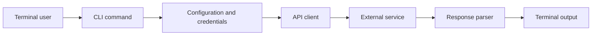

<!-- unified-readme:start -->
<div align="center">

# RoboPack CLI

**CLI tool for interacting with the Robopack API for automated software packaging.**

Build. Automate. Share.

[](https://github.com/JayRHa/RoboPackCLI/stargazers)
[](https://github.com/JayRHa/RoboPackCLI/network/members)
[](https://github.com/JayRHa/RoboPackCLI/issues)
[](https://github.com/JayRHa/RoboPackCLI/graphs/contributors)

<h1>Robopack CLI</h1>
  <p><strong>Search, import, package, and deploy applications from Robopack in one scriptable terminal interface.</strong></p>
  <p>
    
    
    
    
  </p>

---

`CLI Tool` | `Python` | `Public` | `Maintained`

</div>

## What is this?

RoboPack CLI wraps a service or workflow in a command-line interface so common tasks can be automated from a terminal, shell script, or scheduled job.

## Project Context

- Primary stack: Python.
- Typical usage starts with local configuration or credentials, then executes commands against the target service API.
- This repository is maintained as a practical project and reference asset.

## How It Works

The CLI parses user input, loads configuration, calls the external service, normalizes the response, and prints script-friendly output.



## Quick Start

1. Review the project context and workflow below.
2. Clone the repository:

   ```bash
   git clone https://github.com/JayRHa/RoboPackCLI.git
   ```

3. Continue with the setup, usage, or workflow sections below.

---
<!-- unified-readme:end -->

## Overview

`robopack` is a high-signal command line tool for:

- searching Robopack app catalog entries
- importing apps into package artifacts
- managing tenant uploads and upload states
- listing and inspecting deployment templates
- working with script templates for package scripts
- clean machine-readable JSON for pipelines

## 60-Second Quickstart

```bash
python3 -m venv .venv
source .venv/bin/activate
python3 -m pip install -e .
export ROBOPACK_API_KEY="<YOUR_API_KEY>"

robopack app-search --query "7-zip"
robopack app-import --app-id 9eab3951-90a2-4ef5-b0f6-2f34db4499f0 --scope machine
robopack package-download --package-id f13474e4-bff6-4637-9b1f-f7ce68b56dab --format IntuneWin --json
```

## Why It Feels Great To Use

- Single command surface: `robopack`
- Strict argument validation with clear input errors
- Human-readable operator output and deterministic JSON output
- Binary downloads (packages and banners) with predictable file handling
- Predictable exit codes for CI and shell automation

## Install

```bash
python3 -m pip install -e .
```

If your Python is externally managed, use a virtualenv (recommended).

## Authentication

Use one of these:

```bash
robopack --api-key "<KEY>" app-search --query "chrome"
```

```bash
export ROBOPACK_API_KEY="<KEY>"
robopack app-search --query "chrome"
```

Optional environment override for non-production base URL:

```bash
export ROBOPACK_BASE_URL="https://api-test.robopack.com/v1"
```

## Command Matrix

| Command | Purpose | Common flags |
| --- | --- | --- |
| `app-search` | Search catalog apps | `--query --logo --items-per-page --page --json` |
| `app-showcase` | List showcase apps | `--logo --items-per-page --page --json` |
| `app-verified` | List verified apps | `--logo --items-per-page --page --json` |
| `app-get` | Get app details | `--app-id --json` |
| `app-import` | Import app to package | `--app-id --scope --version-id --json` |
| `package-list` | List packages | `--items-per-page --page --sort-by --json` |
| `package-get` | Get package details | `--package-id --json` |
| `package-download` | Download package artifact | `--package-id --format --template-id --output` |
| `tenant-list` | List tenants | `--items-per-page --page --json` |
| `tenant-get` | Get tenant details | `--tenant-id --json` |
| `tenant-upload` | Upload package to tenant | `--tenant-id --package-id --wait --json` |
| `tenant-upload-status` | Read upload operation status | `--upload-id --json` |
| `template-list` | List templates | `--items-per-page --page --json` |
| `template-get` | Get template details | `--template-id --json` |
| `template-banner` | Download template banner image | `--template-id --output --json` |
| `script-template-list` | List script templates | `--items-per-page --page --json` |
| `script-template-get` | Get script template details | `--script-template-id --json` |

## Usage Examples

### app-search

```bash
robopack app-search --query "7-zip"
robopack app-search --query "visual studio" --logo --items-per-page 25 --page 1 --json
```

### app-showcase

```bash
robopack app-showcase
robopack app-showcase --logo --items-per-page 20 --sort-by name --json
```

### app-verified

```bash
robopack app-verified
robopack app-verified --items-per-page 50 --sort-desc --json
```

### app-get

```bash
robopack app-get --app-id 9eab3951-90a2-4ef5-b0f6-2f34db4499f0
robopack app-get --app-id 9eab3951-90a2-4ef5-b0f6-2f34db4499f0 --json
```

### app-import

```bash
robopack app-import --app-id 9eab3951-90a2-4ef5-b0f6-2f34db4499f0 --scope machine
robopack app-import --app-id 9eab3951-90a2-4ef5-b0f6-2f34db4499f0 --scope user --version-id 7679e579-c4d9-47b8-95e0-c76457ce6a1f --json
```

### package-list

```bash
robopack package-list
robopack package-list --items-per-page 100 --sort-by updatedDate --sort-desc --json
```

### package-get

```bash
robopack package-get --package-id f13474e4-bff6-4637-9b1f-f7ce68b56dab
robopack package-get --package-id f13474e4-bff6-4637-9b1f-f7ce68b56dab --json
```

### package-download

```bash
robopack package-download --package-id f13474e4-bff6-4637-9b1f-f7ce68b56dab --format IntuneWin
robopack package-download --package-id f13474e4-bff6-4637-9b1f-f7ce68b56dab --format PSADT --template-id f2cb325c-c20d-4144-b0de-1a1f3b8f74a5 --no-script-wrap --output ./downloads/psadt.zip
```

### tenant-list

```bash
robopack tenant-list
robopack tenant-list --items-per-page 25 --page 1 --json
```

### tenant-get

```bash
robopack tenant-get --tenant-id ac6f8991-f31f-4039-9fce-6dbf7eb3f4bd
robopack tenant-get --tenant-id ac6f8991-f31f-4039-9fce-6dbf7eb3f4bd --json
```

### tenant-upload

```bash
robopack tenant-upload --tenant-id ac6f8991-f31f-4039-9fce-6dbf7eb3f4bd --package-id f13474e4-bff6-4637-9b1f-f7ce68b56dab
robopack tenant-upload --tenant-id ac6f8991-f31f-4039-9fce-6dbf7eb3f4bd --package-id f13474e4-bff6-4637-9b1f-f7ce68b56dab --wait --no-upload-as-win32-app --json
```

### tenant-upload-status

```bash
robopack tenant-upload-status --upload-id 80ae1e16-9199-4608-b2e9-8e6c55f7f1ab
robopack tenant-upload-status --upload-id 80ae1e16-9199-4608-b2e9-8e6c55f7f1ab --json
```

### template-list

```bash
robopack template-list
robopack template-list --items-per-page 50 --sort-by updatedDate --json
```

### template-get

```bash
robopack template-get --template-id f2cb325c-c20d-4144-b0de-1a1f3b8f74a5
robopack template-get --template-id f2cb325c-c20d-4144-b0de-1a1f3b8f74a5 --json
```

### template-banner

```bash
robopack template-banner --template-id f2cb325c-c20d-4144-b0de-1a1f3b8f74a5
robopack template-banner --template-id f2cb325c-c20d-4144-b0de-1a1f3b8f74a5 --output ./downloads/banner.png --json
```

### script-template-list

```bash
robopack script-template-list
robopack script-template-list --items-per-page 100 --sort-by name --json
```

### script-template-get

```bash
robopack script-template-get --script-template-id 8b52b041-b6e1-466e-b198-903b4f6a1eb7
robopack script-template-get --script-template-id 8b52b041-b6e1-466e-b198-903b4f6a1eb7 --json
```

## Automation Recipes

Get first app id for a search term:

```bash
robopack app-search --query "7-zip" --json | jq -r '.apps[0].app_id'
```

Import an app and capture package id:

```bash
robopack app-import --app-id "$APP_ID" --scope machine --json | jq -r '.package_id'
```

Download a package directly into `artifacts/`:

```bash
robopack package-download --package-id "$PACKAGE_ID" --format IntuneWin --output "artifacts/$PACKAGE_ID.intunewin"
```

Poll upload state in a loop:

```bash
while true; do
  robopack tenant-upload-status --upload-id "$UPLOAD_ID" --json | jq -r '.upload.state'
  sleep 10
done
```

Get all entry point scripts from script templates:

```bash
robopack script-template-list --json | jq -r '.script_templates[] | [.name, .entry_point_script] | @tsv'
```

## Exit Codes

| Code | Meaning |
| --- | --- |
| `0` | Success |
| `1` | API/network/runtime error |
| `2` | Input/auth/rate-limit error |

## Troubleshooting

`Input error: API key missing`
Set `ROBOPACK_API_KEY` or pass `--api-key`.

`Input error: --app-id must be a valid UUID`
Use a UUID from Robopack API responses.

`Input error: --page must be 1 or greater`
Robopack pagination is 1-based (`--page 1` is the first page).

`Error: Invalid API key`
Check key scope and whether you are targeting the correct environment.

`Error: Request limit exceeded`
Retry after cooldown and reduce request frequency.

`Error while calling Robopack API: ...`
Inspect endpoint inputs (`--base-url`, IDs, paging flags), then retry with `--json` for easier debugging.

## Developer Notes

Run from source:

```bash
PYTHONPATH=src python3 -m robopack_cli --help
```

Compile check:

```bash
python3 -m compileall -q src tests
```

Tests:

```bash
PYTHONPATH=src python3 -m pytest -q
```

## Project Structure

```text
src/robopack_cli/
  cli.py           # parsing, command execution, output rendering
  transform.py     # normalization layer
  const.py         # constants and mappings
  __main__.py      # python -m entrypoint
tests/
  test_transform.py
```

## Security

- Never commit API keys.
- Prefer environment variables in CI/CD.
- Use `--base-url`/`ROBOPACK_BASE_URL` carefully to avoid mixing test and production.
- Rotate keys immediately if exposed.
